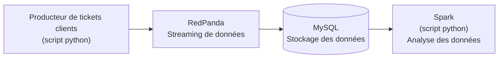

# Pipeline de gestion de tickets clients

Ce projet implémente un pipeline de gestion de tickets clients en utilisant Redpanda et Spark

## Structure principale du projet

```
├── configs/             # Dossier regroupant des fichiers de configuration
├── dockerfiles/         # Dossier regroupant les Dockerfile utilisés
├── docker-compose.yml   # Fichier yaml spécifiant les services Docker
├── results.pdf          # Résultats d'analyse
├── scripts/             # Dossier regroupant les scripts utilisés (SQL, python, shell)
```

### 1. Définir les variables d'environnement

```bash
# Copier le template et éditer le fichier .env
cp .env.template .env
```

| Variable | Description |
| -------- | -------     |
| KAFKA_SERVER | URL du service Redpanda |
| MYSQL_DATABASE | nom de la base de données MySQL | 
| MYSQL_HOST | nom du service MySQL |
| MYSQL_PASSWORD | mot de passe du compte MySQL  |
| MYSQL_ROOT_PASSWORD | mot de passe du super administateur MySQL |
| MYSQL_USER | nom d'utilisateur du compte MySQL
| REDPANDA_TOPIC | nom du topic Redpanda |

Exemple:

```
KAFKA_SERVER=redpanda:9092
MYSQL_DATABASE=client_tickets
MYSQL_HOST=mysql
MYSQL_PASSWORD=apppass
MYSQL_PORT=3306
MYSQL_ROOT_PASSWORD=root_password
MYSQL_USER=app
REDPANDA_TOPIC=client_tickets
```

### 2. Lancement du pipeline

```
docker-compose up -d
```

### 3. Arrêt du pipeline

```
docker-compose down
```

### 4. Schéma du flux de données



### 5. Lecture des analyses de données Spark

```
cat docker/spark/insights/*.json
```

### 6. Vidéo explicative

https://www.youtube.com/watch?v=NcKNvKxRPCc

### 7. Exemple d'analyse des tickets clients par Spark 

Extrait du fichier JSON créé par Spark:

```
{"request_type":"Incident","count":11}
{"request_type":"Demande de service","count":9}
{"request_type":"Maintenance préventive","count":10}
{"request_type":"Problème récurrent","count":2}
```