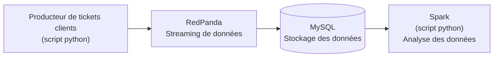

# Pipeline de gestion de tickets clients

### 1. Lancement du pipeline

```
docker-compose up -d
```

### 2. Arrêt du pipeline

```
docker-compose down
```

### 3. Schéma du flux de données



### 4. Lecture des analyses de données Spark

```
cat docker/spark/insights/*.json
```

### 5. Vidéo explicative

https://www.youtube.com/watch?v=NcKNvKxRPCc